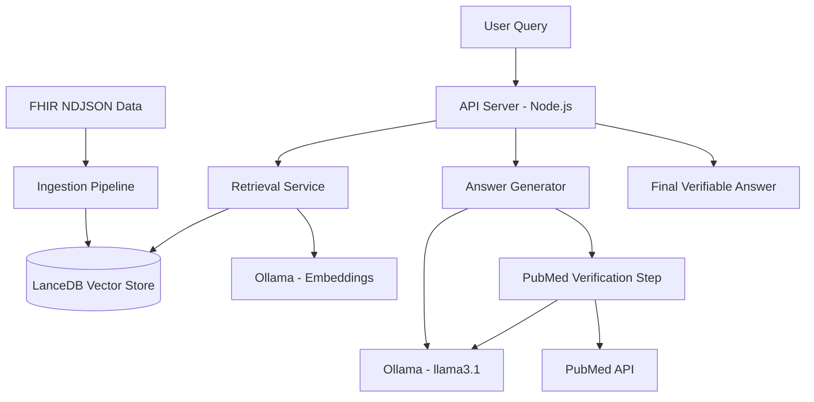
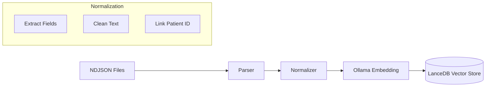

# System Architecture & Dataflow: Healthcare RAG

This document provides a technical deep dive into the architecture, dataflow, and core workflows of the Healthcare RAG system.

## 🏗️ High-Level Architecture

The system is built as a modular micro-service oriented RAG pipeline, prioritizing clinical grounding and verifiable answers.



---

## 📥 Data Ingestion Workflow

The ingestion process transforms loose FHIR resources into a queryable semantic index.



1.  **Parsing**: Reads NDJSON files (Patient, Condition, MedicationRequest, etc.).
2.  **Normalization**: Extracts relevant fields (status, code, dates) and converts them into a flat `NormalizedRecord`.
3.  **Semantic Vectorization**: Uses `nomic-embed-text` via Ollama to generate 768-dimensional embeddings for each resource text content.
4.  **Storage**: Persists vectors and metadata into **LanceDB**, an ultra-fast vector database optimized for local storage.

---

## 🔄 RAG Query Dataflow (The "Verification Chain")

The system implements a multi-stage "Verification Chain" to ensure clinical accuracy and minimize hallucinations.

```mermaid
sequence_diagram
    participant U as User
    participant A as API Server
    participant R as Retriever
    participant G as Generator
    participant O as Ollama
    participant P as PubMed

    U->>A: POST /query
    A->>R: retrieve(question)
    R->>O: generateEmbedding(question)
    O-->>R: vector
    R->>A: context + records
    
    A->>G: generateAnswer(context)
    G->>O: llama3.1 (generate)
    O-->>G: initial answer
    
    A->>G: verifyAndRefine(answer)
    G->>P: searchAndFetchArticles()
    P-->>G: medical literature
    G->>O: llama3.1 (refine with PubMed)
    O-->>G: final answer
    
    A->>U: final answer + verification
```

### Stage 1: Intent & Retrieval
- **Question Embedding**: The user's query is vectorized.
- **Vector Search**: LanceDB performs a similarity search to find relevant FHIR resources for the specific `patientId`.
- **Context Construction**: Resources are ranked and formatted into a structured context block.

### Stage 2: Initial Answer Generation
- **Prompt Engineering**: A strict clinical system prompt is combined with the retrieved context.
- **Local Generation**: Ollama (`llama3.1`) generates an initial response based *only* on the provided context.

### Stage 3: PubMed Verification (Grounding)
- **Term Extraction**: The system identifies key medical terms (conditions, drugs) from the initial answer.
- **External Search**: Calls the PubMed API to find matching peer-reviewed literature.
- **Refinement**: A final LLM pass compares the initial answer against PubMed findings to correct any inconsistencies or add professional verification context.

---

## 🛠️ Technical Stack

| Component | Technology | Role |
| :--- | :--- | :--- |
| **Backend** | Node.js / Express | API Orchestration & Service Layer |
| **Vector DB** | LanceDB | Semantic Storage & Retrieval |
| **LLM Engine** | Ollama | Local Inference (Embeddings & Generation) |
| **External API** | PubMed e-utilities | Scientific Verification |
| **Evaluation** | DeepEval (Python) | Automated Metric Measurement |

---

## 🔒 Security & Privacy
- **Local-First**: All PHI (Patient Health Information) is processed locally via Ollama.
- **Resource Isolation**: Queries are strictly scoped to the provided `patientId` to prevent cross-patient data leakage.
- **PubMed Anonymization**: Only general medical terms (not patient-specific data) are sent to PubMed for verification.
